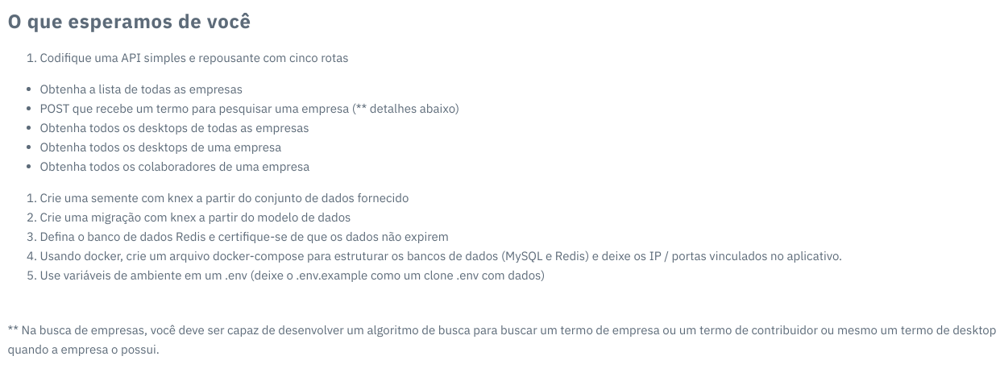

<h1 align="center">
    
</h1>

<h1 align="center">
   🙂 <a href="#"> reload challenge </a>
</h1>

<h3 align="center">
    this is a challenge proposed by the reload company, for an evaluation process, for employment opportunities
</h3>

<p align="center">
  

  

  <!-- <a href="https://www.twitter.com/jhonatheberson/">
    
  </a> -->

  <a href="https://github.com/jhonatheberson/easy-church/releases">
        
  </a>
  <a href="https://github.com/jhonatheberson/reload-challenge/commits/master">
    
  </a>

   
   <a href="https://github.com/jhonatheberson/reload-challenge/stargazers">
    
  </a>

  <a href="https://github.com/jhonatheberson">
    
  </a>

  <!-- <a href="https://blog.rocketseat.com.br/">
    
    </a>  -->
</p>

<h4 align="center">
	 <!-- Status: development -->
    Status: Finished
</h4>

<p align="center">
 <a href="#about">About</a> •
 <a href="#features">Features</a> •
 <a href="#layout">Layout</a> •
 <a href="#how-it-works">How it works</a> •
 <a href="#tech-stack">Tech Stack</a> •
 <a href="#contributors">Contributors</a> •
 <a href="#author">Author</a> •
 <a href="#user-content-license">License</a>

</p>

## About

this challenge was used pure [node.js](https://nodejs.org/en/) with [express](https://expressjs.com/pt-br/), and [Knex](https://knexjs.org/) for database connection, using migrations, seed. also performed using automation with [docker](https://www.docker.com/), and [docker-compose](https://docs.docker.com/compose/), to automate, relational database [mysql](https://www.mysql.com/), memory database [redis](https://redis.io/) and propria api.

---

## Features

- [x] build a restful, five-route API:

  - [x] get list of all companies.
  - [x] POST that receives a search term for a company, this search, needs to develop a search algorithm for each company term or contributor, or desktop.
  - [x] Get every desktop from every company
  - [x] Get all desktops from a company
  - [x] get all employees of a company


- [x] create a seed with knex from provided dataset
- [x] create a migration with knex from the data model
- [x] define the redis database and make sure the data does not expire.  **in this requirement, as a computer engineer, I find it unnecessary to use the redis database for authentication, so I implemented it in another way, thus performing treadoff, to use Redis, for more relevant processes such as managing queues and jobs**
- [x] using docker, create a docker-compose to structure the databases (MySQL and Redis) and leave the IP / ports bound in the application
- [x] use environment variables in an .env (leave the .env.example as a clone with data)


## PLUS:

- [x] creation of routes and controller, for user table related to company
- [x] authentication with JWT, securely and efficiently without using Redis. *obs: it expires in 7 days, but I can leave it to never sneeze as requested*

---

## Layout

<!-- The application layout is available on Figma:

<a href="https://www.figma.com/file/1SxgOMojOB2zYT0Mdk28lB/Ecoleta?node-id=136%3A546">
  
</a> -->

<!-- ### Mobile

<p align="center">
  

  
</p> -->

### Web

<p align="center" style="display: flex; align-items: flex-start; justify-content: center;">
  

  
</p>

---

## How it works

This project is divided into one parts:

1. Backend (server folder)
<!-- 2. Frontend (web folder)
3. Mobile (mobile folder) -->

<!-- Both Frontend and Mobile need the Backend to be running to work. -->

### Pre-requisites

Before you begin, you will need to have the following tools installed on your machine:
[Git](https://git-scm.com), [Node.js](https://nodejs.org/en/).
In addition, it is good to have an editor to work with the code like [VSCode](https://code.visualstudio.com/)

#### Rodando o Backend (servidor)

```bash

# Clone this repository
$ git clone git@github.com:jhonatheberson/reload-challenge.git

# Access the project folder cmd/terminal
$ cd reload-challenge

# run docker-compose
$ docker-compose up

# perform the migrations
$ knex migrate:latest

# run the seeds
$ knex seed:run


# I tried to run the api also inside the docker, but there is some conflict on the network, it is confused when trying to connect to the database

#if this also occurs, on your machine, just execute a stop in the container only from the API

#run api in terminal
$ yarn dev


# The server will start at port: 3333 - go to http://localhost:3333

```


</p>

### perceba que o não estou conseguindo rodar api direto no docker, ele está dando problema de conexão confusa, deve ser alguma porta, algo do tipo relacionado a rede, como já mencionei acima.

## mas se para o container da api, e rodar *yarn dev* no terminal irá funcionar perfeitamente, como já mencionado acima.


</p>

<p align="center">
  <a href="https://github.com/jhonatheberson/reload-challenge/blob/master/Insomnia_API.json" target="_blank"></a>
</p>

<!-- #### Running the web application (Frontend)

```bash

# Clone this repository
$ git clone git@github.com: jhonatheberson / README-ecoleta.git

# Access the project folder in your terminal
$ cd README-ecoleta

# Go to the Front End application folder
$ cd web

# Install the dependencies
$ npm install

# Run the application in development mode
$ npm run start

# The application will open on the port: 3000 - go to http://localhost:3000

``` -->

---

## Tech Stack

The following tools were used in the construction of the project:

<!-- #### **Website** ([React](https://reactjs.org/) + [TypeScript](https://www.typescriptlang.org/))

- **[React Router Dom](https://github.com/ReactTraining/react-router/tree/master/packages/react-router-dom)**
- **[React Icons](https://react-icons.github.io/react-icons/)**
- **[Axios](https://github.com/axios/axios)**
- **[Leaflet](https://react-leaflet.js.org/en/)**
- **[React Leaflet](https://react-leaflet.js.org/)**
- **[React Dropzone](https://github.com/react-dropzone/react-dropzone)**

> See the file [package.json](https://github.com/jhonatheberson/README-ecoleta/blob/master/web/package.json) -->

#### [](https://github.com/jhonatheberson/Ecoleta#server-nodejs--typescript)**Server** ([NodeJS](https://nodejs.org/en/)
<!-- + [TypeScript](https://www.typescriptlang.org/) -->
)

- **[Express](https://expressjs.com/)**
- **[CORS](https://expressjs.com/en/resources/middleware/cors.html)**
- **[KnexJS](http://knexjs.org/)**
<!-- - **[SQLite](https://github.com/mapbox/node-sqlite3)**
- **[ts-node](https://github.com/TypeStrong/ts-node)** -->
- **[dotENV](https://github.com/motdotla/dotenv)**
- **[Multer](https://github.com/expressjs/multer)**
<!-- - **[Celebrate](https://github.com/arb/celebrate)**
- **[Joi](https://github.com/hapijs/joi)** -->

> See the file [package.json](https://github.com/jhonatheberson/reload-challenge/blob/master/server/package.json)

<!-- #### [](https://github.com/jhonatheberson/Ecoleta#mobile-react-native--typescript)**Mobile** ([React Native](http://www.reactnative.com/) + [TypeScript](https://www.typescriptlang.org/))

- **[Expo](https://expo.io/)**
- **[Expo Google Fonts](https://github.com/expo/google-fonts)**
- **[React Navigation](https://reactnavigation.org/)**
- **[React Native Maps](https://github.com/react-native-community/react-native-maps)**
- **[Expo Constants](https://docs.expo.io/versions/latest/sdk/constants/)**
- **[React Native SVG](https://github.com/react-native-community/react-native-svg)**
- **[Axios](https://github.com/axios/axios)**
- **[Expo Location](https://docs.expo.io/versions/latest/sdk/location/)**
- **[Expo Mail Composer](https://docs.expo.io/versions/latest/sdk/mail-composer/)**

> See the file [package.json](https://github.com/jhonatheberson/README-ecoleta/blob/master/mobile/package.json) -->

#### [](https://github.com/jhonatheberson/Ecoleta#utilit%C3%A1rios)**Utilitários**

- Prototype: **[Figma](https://www.figma.com/)** → **[Protótipo (Ecoleta)](https://www.figma.com/file/1SxgOMojOB2zYT0Mdk28lB/Ecoleta)**
<!-- - API: **[IBGE API](https://servicodados.ibge.gov.br/api/docs/localidades?versao=1)** → **[API de UFs](https://servicodados.ibge.gov.br/api/docs/localidades?versao=1#api-UFs-estadosGet)**, **[API de Municípios](https://servicodados.ibge.gov.br/api/docs/localidades?versao=1#api-Municipios-estadosUFMunicipiosGet)** -->
<!-- - Maps: **[Leaflet](https://react-leaflet.js.org/en/)** -->
- Editor: **[Visual Studio Code](https://code.visualstudio.com/)**
<!-- → Extensions: **[SQLite](https://marketplace.visualstudio.com/items?itemName=alexcvzz.vscode-sqlite)** -->
- Markdown: **[StackEdit](https://stackedit.io/)**, **[Markdown Emoji](https://gist.github.com/rxaviers/7360908)**
- Commit Conventional: **[Commitlint](https://github.com/conventional-changelog/commitlint)**
- API Test: **[Insomnia](https://insomnia.rest/)**
<!-- - Icons: **[Feather Icons](https://feathericons.com/)**, **[Font Awesome](https://fontawesome.com/)**
- Fonts: **[Ubuntu](https://fonts.google.com/specimen/Ubuntu)**, **[Roboto](https://fonts.google.com/specimen/Roboto)** -->

---

## Contributors

A big thanks to this group that made this product leave the field of idea and enter the app stores :)

You are an awesome team! :)

<!--
<table>
  <tr>
    <td align="center"><a href="https://rocketseat.com.br"><br /><sub><b>Diego Fernandes</b></sub></a><br /><a href="https://rocketseat.com.br/" title="Rocketseat"></a></td>
    <td align="center"><a href="https://rocketseat.com.br"><br /><sub><b>Cleiton Souza</b></sub></a><br /><a href="https://rocketseat.com.br/" title="Rocketseat"></a></td>
    <td align="center"><a href="https://rocketseat.com.br"><br /><sub><b>Robson Marques</b></sub></a><br /><a href="https://rocketseat.com.br/" title="Rocketseat"></a></td>
    <td align="center"><a href="https://rocketseat.com.br"><br /><sub><b>Claudio Orlandi</b></sub></a><br /><a href="https://rocketseat.com.br/" title="Rocketseat"></a></td>
    <td align="center"><a href="https://rocketseat.com.br"><br /><sub><b>Vinícios Fraga</b></sub></a><br /><a href="https://rocketseat.com.br/" title="Rocketseat"></a></td>
    <td align="center"><a href="https://rocketseat.com.br"><br /><sub><b>Hugo Duarte</b></sub></a><br /><a href="https://rocketseat.com.br/" title="Rocketseat"></a>  <a href="https://blog.rocketseat.com.br/" title="Blog">🌐</a></td>

  </tr>
  <tr>
    <td align="center"><a href="https://rocketseat.com.br"><br /><sub><b>Joseph Oliveira</b></sub></a><br /><a href="https://rocketseat.com.br/" title="Rocketseat"></a></td>
    <td align="center"><a href="https://rocketseat.com.br"><br /><sub><b>Guilherme Rodz</b></sub></a><br /><a href="https://rocketseat.com.br/" title="Rocketseat"></a></td>
    <td align="center"><a href="https://rocketseat.com.br"><br /><sub><b>Mayk Brito</b></sub></a><br /><a href="https://rocketseat.com.br/" title="Rocketseat"></a></td>
    <td align="center"><a href="https://rocketseat.com.br"><br /><sub><b>João Paulo</b></sub></a><br /><a href="https://rocketseat.com.br/" title="Rocketseat"></a></td>
    <td align="center"><a href="https://rocketseat.com.br"><br /><sub><b>Luke Morales</b></sub></a><br /><a href="https://rocketseat.com.br/" title="Rocketseat"></a></td>
     <td align="center"><a href="https://rocketseat.com.br"><br /><sub><b>Luiz Batanero</b></sub></a><br /><a href="https://rocketseat.com.br/" title="Rocketseat"></a></td>

  </tr>
</table> -->

## How to contribute

1. Fork the project.
2. Create a new branch with your changes: `git checkout -b my-feature`
3. Save your changes and create a commit message telling you what you did: `git commit -m" feature: My new feature "`
4. Submit your changes: `git push origin my-feature`
   > If you have any questions check this [guide on how to contribute](./CONTRIBUTING.md)

---

## Author

<a href="https://github.com/jhonatheberson">
 
 <br />
 <sub><b>Jhonat Heberson</b></sub></a> <a href="https://github.com/jhonatheberson" title="Github"></a>
 <br />

<!-- [](https://twitter.com/jhonatheberson)  -->

[](https://www.linkedin.com/in/jhonat-heberson-64816616a/)
[](mailto:jhonatheberson@gmail.com)

---

## License

This project is under the license [MIT](./LICENSE).

---
